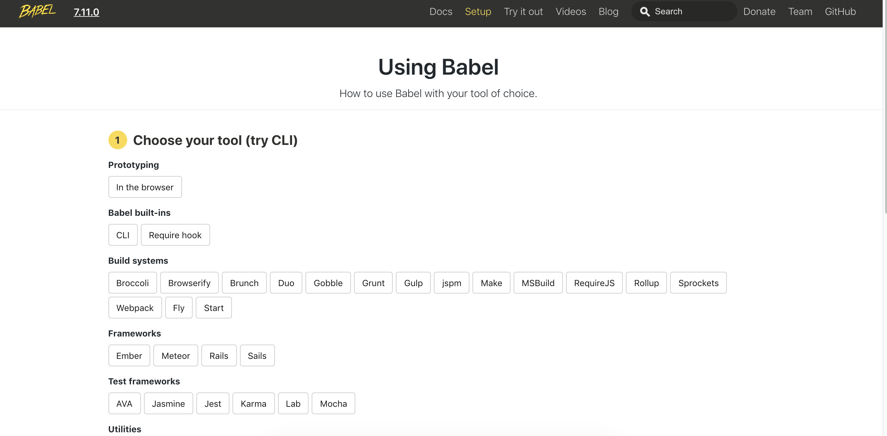

## 3.1 概述
ECMAScript 6, 也就是ECMAScript 2015, 是最新版的ECMAScript标准. ES6是JavaScript语言的重要更新, 同时也是自2009年的ES5以来的第一次正式更新. 目前, 主要的JavaScript引擎正在实现这些功能.           
虽然目前并不是所有浏览器都能兼容ES6全部特性，但越来越多的程序员在实际项目当中已经开始使用ES6了。所以作为一名合格的前端工程师不得不学习ES6的语法。

在介绍ES6的新特性之前，先介绍一下[Babel官网](https://link.jianshu.com/?t=https%3A%2F%2Fbabeljs.io%2F)。Babel是一款比较流行的ES6语法转ES5的转化器。具体的使用方法可以查阅官网。



## 3.2最常用的新特性
- let, const
- class,extends,super
- Arrows 箭头函数
- emplate string
- destructuring
- default
- rest arguments

以上是ES6中大约20%的新特性，但也是最常用的。

### 3.2.1 let, const
这两个的用途与var类似，都是用来声明变量的，在实际开发它们有各自特定的用途。

详细介绍请查阅我上一篇：[ES6let,const与块作用域](/d-ES6/d-2.ES6let,const与块作用域.md)

**var、let 及 const 区别？**
- 全局申明的 var 变量会挂载在 window 上，而 let 和 const 不会
- var 声明变量存在变量提升，let 和 const 不会
- let、const 的作用范围是块级作用域，而 var 的作用范围是函数作用域
- 同一作用域下 let 和 const 不能声明同名变量，而 var 可以
- 同一作用域下在 let 和 const 声明前使用会存在暂时性死区
- const
    *  一旦声明必须赋值,不能使用 null 占位
    * 声明后不能再修改
    *  如果声明的是复合类型数据，可以修改其属性

### 3.2.2 class, extends, super
在ES5 中一定接触过令人头疼原型、构造函数，继承..这几部分。多多少少会因为搞不清指针指向哪里而纠纷。

ES6提供了更接近传统语言的写法，引入了Class（类）的概念。ES6的类是基于prototype的OO模式的语法糖. 拥有简单方便的声明式格式, 使得类模式更易于使用, 并鼓励互操作性. 类支持基于prototype的继承, 超级调用(super calls), 实例(instance), 静态方法(static methods)以及构造函数。

```js
class Person {
    //构造方法
    constructor() {
        this.type = "person";
    }
    says(word) {
        console.log(this.type + " says " + word);
    }
}
//创建一个实例对象
let person = new Person();
person.says("Hello everyone");  //person says Hello everyone

//继承
class Boy extends Person {
    constructor() {
        super(); //继承父类的构造方法
        //自己的构造方法
        this.type = "boy";
    }
}
let boy = new Boy();
boy.says("I am a boy");  //boy says I am a boy
```

上面的代码用class创建了一个Person类，里面有一个constructor方法，这句诗构造方法，this代表着实例对象。也就是说，constructor内定义的方法和属性就是是实例对象自己本身的，而constructor外定义的方法和属性是所有实例对象可以共享的。

class之间可以通过**extends关键字**来实现继承，这比ES5中改变原型的实现继承会方便很多。上面定义了一个Boy类继承Person类，Boy也称Person类的子类，Boy类继承了Person类的所有属性和方法。

**super关键字**：它指的是父类实例（即父类的this对象），子类必须在constructor方法中才能调用super方法，否则在创建新的实例的时候会报错。这是因为子类没有自己的this对象，而是继承父类的this对象，然后对其进行加工。如果不调用super方法，子类就得不到this对象。

实际上，**ES6的继承机制**，就是先创造父类的实例对象this（所以必须先调用super方法），然后再用子类的构造函数修改this。

### 3.2.3 Arrows 箭头函数
Arrows是函数的一种缩写, 表现形式为=>. 它们在语法上, 类似于C#, Java 8以及CoffeeScript. 它们不仅支持块级函数体, 同时也支持带返回值的表达式函数体. 与普通函数的this作用域不同, 箭头函数内部与它周围代码共享this作用域. 即, this指向同一个东西.    
下面对比ES5中的函数写法和ES6中箭头函数的写法。
```js
//ES5
function fun(num) {
    return num + 1;
}
// ES6
(num) => num + 1;
```

除了简洁意外，arrows function还提供了一个超级好用的功能！       
长期以来，JavaScript中this一直都是在开发过程中很令人头疼的事。在对象中使用this必须要非常小心。比如：
```js
class Person {
    constructor(){
        this.type = 'person'
    }
    says(say){
        setTimeout(function(){
            console.log(this.type + ' says ' + say)
        }, 1000)
    }
}

var person = new Person()
person.says('hello')  //undefined says hello
```
上面的代码输出的是`undefined says hello`而不是`person says hello`。这是因为setTimeout中的this指的是全局变量，为了解决以上的问题，我们有两种方法：

- 第一种是保存says方法的this，用`_this`来代指this。
```js
    says(say){
        let _this = this;
        setTimeout(function(){
            console.log(_this.type + ' says ' + say)
        }, 1000)
    }
```
- 第二种方法是`bind(this)`,也就是。
```js
    says(say){
        setTimeout(function(){
            console.log(this.type + ' says ' + say)
        }.bind(this), 1000)
    }
```
- 使用箭头函数
```js
    says(say) {
        setTimeout(() => {
            console.log(this); //Perosn{}
            console.log(this.type + ' says ' + say);
        },1000)
    }
```
使用箭头函数时，函数体内的this是定义时所在的对象，而不是使用时所在的对象。因为箭头函数根本就不存在this。

### 3.2.4 Template Strings 模板字符串
模板字符串(template strings)提供了一个构建字符串的语法糖. 这有点类似于Perl, Python以及其它类似语言的字符串插入功能. 当我们要插入大段的html内容到文档中时，使用模板字符串就会方便很多。

来看一段数据绑定的代码：
```js
//数据绑定
let str = ``;
for(let i=0;i<productData.length;i++) {
    let {
        title,
        img,
        price
    } = productData[i];
    //使用模板字符串
    str += `
    <li>
    <a href="#">
        
        <p>${title}</p>
        <span>￥${price}</span>
    </a>
    </li> `
}
listBox.innerHTML = str;
```

用` `` `来标识起始，用`${}`来标识变量，而且所有的空格和换行都会保留在输出的结果中。

### 3.2.5 Destructuring 解构
解构允许使用模式匹配进行绑定, 支持匹配数组和对象. 解构是故障弱化(指未匹配上时, 也不会出错, 而是产生一个undefined值), 类似于标准对象查找foo["bar"], 当未找到时, 产生一个undefined 值 .

```js
/ list 匹配
let [a,,b] = [1,2,3];
console.log(a,b);  //1,3

// 对象匹配简写
let name = "ken",
    age = 20,
    height = 120;
let obj = {
    name,
    age,
    height
}
console.log(obj);  //{name: "ken", age: 20, height: 120}

// 可用于参数位置
function g({name: x}) {
    console.log(x); // kendy
}
g({name: "kendy"});

// 故障弱化解构(减少bug)
let [day] = [];
console.log(day === undefined); //true

// 故障弱化解构, 带默认值(减少bug)
let [aaa = 1]=[];
console.log(aaa === 1);  //true
```

### 3.2.6 Default + Rest 默认参数, 剩余参数
为函数的参数设置默认值. 将传入的参数的剩余参数绑定到数组. 使用`...操作符`, 将数组解构成参数列表 .大家可以看下面的例子，调用`animal()`方法时忘了传参数，传统的做法就是加上这一句`type = type || 'cat'`来指定默认值。

```js
function animal(type){
    type = type || 'cat'  
    console.log(type)
}
animal()  //cat
animal("dog");  //dog
```
如果我们用es6的写法可以这样写：
```js
function animal(type = 'cat'){
    console.log(type)
}
animal()  //cat
animal("dog");  //dog
```
后面的rest语法也很简单：
```js
// 将传入的参数的剩余参数绑定到数组
function f(x, ...y) {
    // y是一个数组Array
    return x * y.length;
}
console.log( f(3, "hello", true) );  //6

// 使用...操作符, 将数组解构成参数列表(数组转成列表)
function f(x, y, z) {
    return x + y + z;
}
// 传入一个数组作为参数
f(...[1, 2, 3]) === 6;
```
上面的实现代码如果使用ES5语法的话就得用`arguments`。

> 未完待续...


