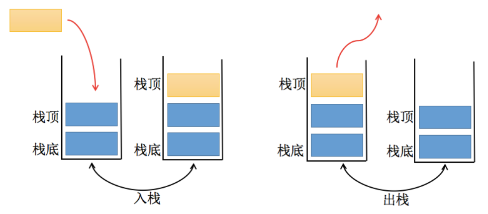
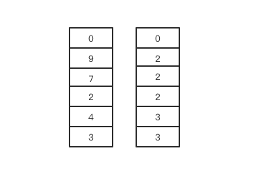
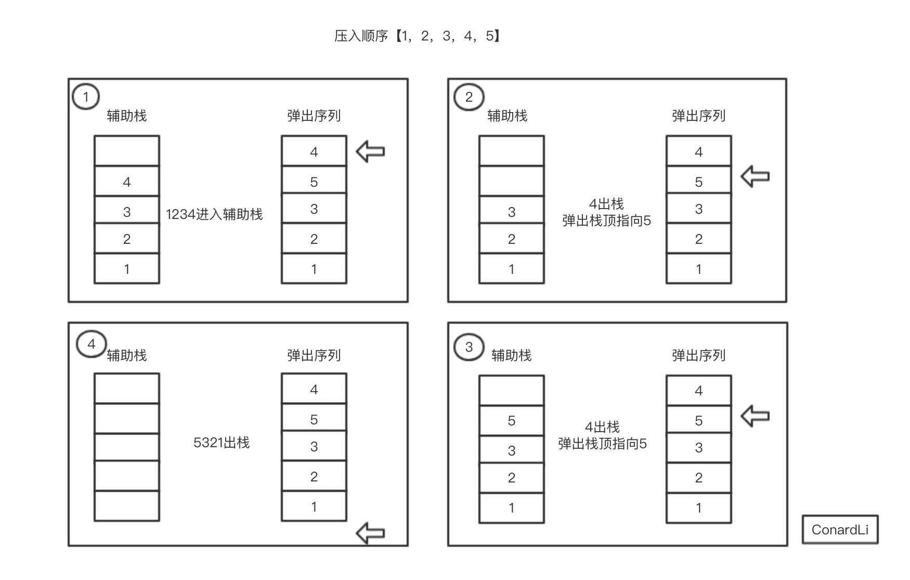

## 1.栈
栈是一个线性结构，在计算机中是一种相当常见的数据结构。
### 1.1 栈与数组对比
我们知道数组是一种**线性结构**，并且可以在数组的**任意位置**插入和删除数据。但是有时候，我们为了实现某些功能，必须对这种任意性加以限制。而**栈和队列**就是比较常见的**受限线性结构**，我们先从栈开始介绍。
 
栈的特点：**先进先出（LIFO）**
- 其限制是仅允许在**表的一端**进行插入和删除运算，这一端被称为**栈顶**，相对地，把另一端称为**栈底**。
- LIFO表示就是后进入的元素，第一个弹出栈空间，类似自动餐托盘，最后放上的托盘，往往先把它拿出去使用。
- 向一个栈插入新元素又称**进栈、入栈**或者**压栈**，它是把新元素放到栈顶元素的上面，使之成为新的栈顶元素；
- 从一个栈删除元素又称作**出栈**或者**退栈**，它是把栈顶元素删除掉，使其相邻的元素成为新的栈顶元素。
### 1.2 栈的实现
#### 1.2.1 栈的常见操作
- push（element）：添加一个新元素到栈顶位置；
- pop（）：移除栈顶的元素，同时返回被移除的元素；
- peek（）：返回栈顶的元素，不对栈做任何修改（该方法不会移除栈顶的元素，仅仅返回它）；
- isEmpty（）：如果栈里没有任何元素就返回true，否则返回false；
- size（）：返回栈里的元素个数。这个方法和数组的length属性类似；
- toString（）：将栈结构的内容以字符串的形式返回。
#### 1.2.2 栈的封装
```js
//封装栈类
function Stack() {
    //栈中的属性
    this.items = [];

    //栈的相关操作
    //1.push(): 将元素压入栈
    //方法一（不推荐）：给当前兑现添加的方法，其他对象不能使用
    /* this.push = () => {

    } */

    //方法二：给Stack的原型上添加方法，能够给多个对象使用
    Stack.prototype.push = function(element) {
        this.items.push(element);
    }

    //2.pop(): 从栈中取出元素
    Stack.prototype.pop = function() {
        return this.items.pop(); //返回最后一个元素，也就是栈顶元素
    }

    //3.peek(): 查看栈顶元素
    Stack.prototype.peek() = function() {
        return this.items[this.items.length - 1];
    }

    //4. isEmpty(): 判断栈是否为空
    Stack.prototype.isEmpty() = function() {
        return this.items.length === 0;
    }

    //5.size(): 获取栈中元素的个数
    Stack.prototype.size() = function() {
        return this.items.length;
    }

    //6.toString(): 以字符串的形式输出栈的元素
    Stack.prototype.toString() = function() {
        //希望输出的形式：20 10 12 8 7
        var retString = '';
        for(var i = 0;i<this.items.length;i++) {
            retString += items[i] + ' ';
        }
        return retString;
    }
}
```

#### 1.2.3 栈的操作的使用
```js
let s = new Stack();
// 入栈
s.push(12);
s.push(23);
s.push(34);
s.push(45);

console.log(s);
// [12,23,34,45]

//取出栈顶元素
console.log(s.pop());   //45
console.log(s);         //[12,23,34]

//查看栈顶元素
console.log(s.peek()); //34
// 判断栈是否为空
console.log(s.isEmpty()); //false
//查看栈中元素的个数
console.log(s.size());  //3
// 以字符串的形式输出栈内的元素
console.log(s.toString());  //'12,23,34'

```
#### 1.2.4 栈的应用 —— 十进制转二进制
利用栈结构的特点封装十进至转换为二进至的函数：
> 100 --> 1100100   
100/2 ==> 余数 0    
50/2  ==> 余数 0    
25/2  ==> 余数 1    
12/2  ==> 余数 0    
6/2   ==> 余数 0    
3/2   ==> 余数 1    
1/2   ==> 余数 1    

代码实现：
```js
// 函数：将十进制转成二进制
function dec2bin(decNumber) {
    //1.定义一个栈，保存余数
    var stack = new Stack();

    //2.循环操作
    while(decNumber) {
        //2.1 获取余数，并且放入到栈中
        stack.push(decNumber % 2);

        //2.2 获取整除后的结果，用于下一次循环
        decNumber = Math.floor(decNumber / 2);  //floor向下取整
    }

    //3.从栈中取出0和1
    var bindaryString = '';
    while(!stack.isEmpty()) {
        bindaryString += stack.pop();
    }
    return bindaryString;
}

//测试
console.log(dec2bin(100));  //1100100
console.log(dec2bin(1000));  //1111101000
```

#### 1.2.5 刷题练习
##### 1.2.5.1 有效的括号
>  题目来源：[leetcode20题](https://leetcode-cn.com/problems/valid-parentheses/)

实现代码：
```js
var isValid = function(s) {
    let map = {
        '(': 1,
        ')': -1,
        '[': 2,
        ']': -2,
        '{': 3,
        '}': -3
    }
   let stack = [];
   for(let i=0;i<s.length;i++) {
       if(map[ s[i] ] > 0) {
        stack.push(s[i]);
       }else{
           let last = stack.pop();
           if(map[last] != -(map[ s[i] ])){
               return false;
           }
       }
   }
   if(stack.length > 0) {
        return false;
   }
   return true;
};
```
##### 1.2.5.2 包含迷min函数的栈
> 题目来源：剑指offer

思路：
*   定义两个栈，一个用来存储数据，一个用来存最小的元素。
*   首先把数据进入数据栈
*   每次进栈的时候，都将进栈的数据和最小值栈的顶元素进行比较，如果比栈顶值小就把该数加入最小值栈
*   如果比最小值栈的栈顶元素大，那就把最小值栈的栈顶元素再次（复制）插入最小值栈中。
*   在出栈的时候，需要删除最小值栈的栈顶元素，即最小值栈和数据站都应该出栈。
*   这样最小值栈的栈顶元素就永远都是当前栈的最小值

以数据[3,4,2,7,9,0]为例，让这组数字依次如栈，则栈和其对应的最小值栈如下：
 
```js
//首先定义两个栈
var dataStack = [];
var minStack = [];
//进栈函数
function push(node) {
    // 首选不管怎么，数据栈都会进栈
    dataStack.push(node);
    // 如果node比最小值栈的栈顶元素小那就把node进入最小值栈，否则就把最小值栈再次（复制）再次入最小值栈
    if (minStack.length === 0 || node < min()) {
        minStack.push(node);
    }else {
        minStack(min());
    }
}
//出栈函数
// 出栈的时候数据栈出栈，最小值栈删掉栈顶元素，
function pop() {
    minStack.pop();
    return dataStack.pop();
}
// 获取最小值栈的栈顶元素
function min() {
    var length = minStack.length;
    return minStack[length - 1]&&length > 0;  //栈不空才能返回
}
```

##### 1.2.5.3 栈的引入和弹出，序列
[题目]
输入两个整数序列，第一个序列表示栈的压入顺序，请判断第二个序列是否为该栈的弹出顺序。
假设压入栈的所有数字均不相等。
例如序列1,2,3,4,5是某栈的压入顺序，序列4，5,3,2,1是该压栈序列对应的一个弹出序列，但4,3,5,1,2就不可能是该压栈序列的弹出序列。
（注意：这两个序列的长度是相等的）

> 题目来源：牛客网-剑指offer

思路：

*   首先判断给出的这两个栈序列是否存在并且不为空
*   然后借助一个工作站，来存放压入栈的弹出过程
*   遍历压入栈，然后依次存入工作站中
*   如果工作栈的栈顶元素和弹出栈的栈顶元素相同，工作站就出栈，并且弹出栈的索引往后移
*   如果不同就继续将压入栈元素压入工作栈继续，相当于入栈
*   最后如果工作站为空就说明第二个序列是第一个序列的弹出顺序
 
```js
//传入两个栈序列，一个是压入栈，一个是弹出栈
function IsPopOrder(pushV,popV) {
    //首先判断这两个栈是否存在并且不为空
    if(pushV || popV || pushV.length === 0 || popV.length === 0 ) {
        return;
    } 
    var workStack = [];  //定义一个工作栈
    var outIndex = 0;  //在弹出栈中移动的索引
    for(var i=0;i<pushV.length;i++) {
        // 从栈底开始把压入栈的元素放入工作栈中
        workStack.push(pushV[i])
        //工作栈栈顶元素和弹出栈索引位置相同的话，工作站出栈，并且索引后进一位
        while(workStack.length && workStack[workStack.length - 1] === popV[outIndex]) {
            workStack.pop();
            outIndex ++;
        }
    }
    // 如果工作栈最后为空，说明弹出栈就是压入栈的出栈序列
    return workStack.length === 0;
}
```


