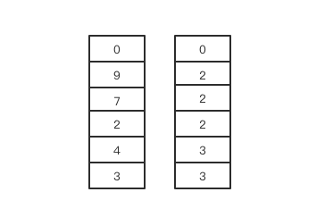
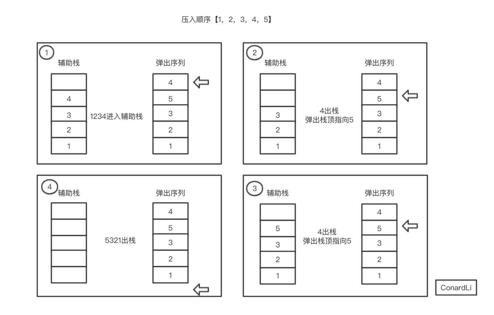

## 3.栈和队列练习
### 3.1 用两个栈来实现一个队列
完成队列的Push和Pop操作。 队列中的元素为int类型。   
思路：定义两个栈1和栈2  
栈1：用于存储队列   
栈2：出队列的时候，栈1的数据依次出栈并进入栈2中，栈2出栈也就是栈1底部出栈的顺序，也就是队列中出栈的次序。   
注意：猪油栈2为空的时候，栈1才能够进数据，否则会打乱出队列的次序。


```js
const stack1 = [];
const stack2 = [];
//入栈函数
function push(node) {
    stack1.push(node);
}
//出栈函数
function pop() {
    //先判断栈2是否为空，为空的话才进栈
    if(stack2.length === 0) {
        //并且栈1的不为空，然后栈1出栈，栈2进栈
        while(stack1.length>0) {
            stack2.push(stack1.pop());
        }
    }
    //栈2出栈，如果栈2内没有元素，就直接返回null
    return stack2.pop() || null;
}
```

#### 扩展：用两个队列实现栈
思路：进栈的时候，如果队列1为空，就进入队列1，如果不为空，就把队列1中的数据灌入到队列2中，然后再把将要入栈的数据插入队列1中，
出栈的时候，如果队列1不为空，就把队列1中的数据出队，如果为空再出队列2的。
```js
const queue1 = [];
const queue2 = [];
//进栈函数
function push(x) {
    if(queue1.length === 0) {
        queue1.push(x);
        //如果queueu2不为空，就一直出队
        while(queue2.length) {
            queue1.push(queue2.shift());  //shift()是删除数组中第一个元素，并返回删除的数的值
            //将队列2删除的数给队列1
        }
    }else if(queue2.length === 0) {
        queue2.push(queue1.shift());
        while(queue1.length) {
            queue2.push(queue1.shift());
        }
    }
}
//出栈的函数
function pop() {
    if(queue1.length != 0) {
        return queue1.shift();
    } else {
        return queue2.shift();
    }
}
```

### 3.2 包含min函数的栈
思路：

*   定义两个栈，一个用来存储数据，一个用来存最小的元素。
*   首先把数据进入数据栈
*   每次进栈的时候，都将进栈的数据和最小值栈的顶元素进行比较，如果比栈顶值小就把该数加入最小值栈
*   如果比最小值栈的栈顶元素大，那就把最小值栈的栈顶元素再次（复制）插入最小值栈中。
*   在出栈的时候，需要删除最小值栈的栈顶元素，即最小值栈和数据站都应该出栈。
*   这样最小值栈的栈顶元素就永远都是当前栈的最小值

以数据[3,4,2,7,9,0]为例，让这组数字依次如栈，则栈和其对应的最小值栈如下：


```js
//首先定义两个栈
var dataStack = [];
var minStack = [];
//进栈函数
function push(node) {
    // 首选不管怎么样，数据栈都会进栈
    dataStack.push(node);
    // 如果node比最小值栈的栈顶元素小那就把node进入最小值栈，否则就把最小值栈再次（复制）再次入最小值栈
    if (minStack.length === 0 || node < min()) {
        minStack.push(node);
    }else {
        minStack.push(min());
    }
}
//出栈函数
// 出栈的时候数据栈出栈，最小值栈删掉栈顶元素，
function pop() {
    minStack.pop();
    return dataStack.pop();
}
// 获取最小值栈的栈顶元素
function min() {
    var length = minStack.length;
    return minStack[length - 1]&&length > 0;  //栈不空才能返回
}
```

### 3.3 滑动窗口的最大值
给定一个数组nums，有一个大小为k的滑动窗口从数组的最左侧移动到数组的最右侧，你只可以看到在滑动窗口k内的数字，滑动窗口每次向右移动一位，返回滑动窗口最大值。
```
输入: nums = [1,3,-1,-3,5,3,6,7], 和 k = 3
输出: [3,3,5,5,6,7] 
解释: 
  滑动窗口的位置                最大值
---------------               -----
[1  3  -1] -3  5  3  6  7       3
 1 [3  -1  -3] 5  3  6  7       3
 1  3 [-1  -3  5] 3  6  7       5
 1  3  -1 [-3  5  3] 6  7       5
 1  3  -1  -3 [5  3  6] 7       6
 1  3  -1  -3  5 [3  6  7]      7
```

**思路**    
使用一个双端队列（队列两面都可以进出），用于存储处于窗口中的值的下标，保证窗口头部元素永远是窗口的最大值。
遍历每个滑块的起始点。
从起始点开始，遍历后续滑块元素。
对比滑块中元素的最大值，并存入结果。

```js
var maxSlidingWindow = function(nums,k) {
    let result = [];
    for(let i=0;i<nums.length-k+1;i++) {
        let max = nums[i];
        for(let i=0;i<j+k;j++) {
            max = Math.max(max,nums[j]);
        }
        //比对完整所有元素之后，将最大值存入result
        result.push(max);
    }
    return result;
}
```

### 3.4 栈的引入和弹出，序列

[题目]
输入两个整数序列，第一个序列表示栈的压入顺序，请判断第二个序列是否为该栈的弹出顺序。
假设压入栈的所有数字均不相等。
例如序列1,2,3,4,5是某栈的压入顺序，序列4，5,3,2,1是该压栈序列对应的一个弹出序列，但4,3,5,1,2就不可能是该压栈序列的弹出序列。
（注意：这两个序列的长度是相等的）

> 题目来源：牛客网-剑指offer

思路：

*   首先判断给出的这两个栈序列是否存在并且不为空
*   然后借助一个工作站，来存放压入栈的弹出过程
*   遍历压入栈，然后依次存入工作站中
*   如果工作栈的栈顶元素和弹出栈的栈顶元素相同，工作站就出栈，并且弹出栈的索引往后移
*   如果不同就继续将压入栈元素压入工作栈继续，相当于入栈
*   最后如果工作站为空就说明第二个序列是第一个序列的弹出顺序


```js
//传入两个栈序列，一个是压入栈，一个是弹出栈
function IsPopOrder(pushV,popV) {
    //首先判断这两个栈是否存在并且不为空
    if(pushV || popV || pushV.length === 0 || popV.length === 0 ) {
        return;
    } 
    var workStack = [];  //定义一个工作栈
    var outIndex = 0;  //在弹出栈中移动的索引
    for(var i=0;i<pushV.length;i++) {
        // 从栈底开始把压入栈的元素放入工作栈中
        workStack.push(pushV[i])
        //工作栈栈顶元素和弹出栈索引位置相同的话，工作站出栈，并且索引后进一位
        while(workStack.length && workStack[workStack.length - 1] === popV[outIndex]) {
            workStack.pop();
            outIndex ++;
        }
    }
    // 如果工作栈最后为空，说明弹出栈就是压入栈的出栈序列
    return workStack.length === 0;
}
```