## 4-1.链表
链表与数组不同，链表中的元素在内存中不必是连续的内存空间。  
链表的每个元素由一个存储元素本身的节点和一个指向下一个元素的引用组成。

相对于数组，链表有一些优点：
- 内存空间不是必须连续的，可以充分利用计算机的内存，实现灵活的内存动态管理。
- 链表不必在创建时确定大小，并且大小可以无限的延伸下去。
- 链表在插入和删除数据时，时间复杂度可以达到O(1),相对数组效率高很多。

相对于数组，链表的缺点：
- 链表访问任何一个位置的元素时，都需要从头开始访问。
- 无法通过下标直接访问元素，需要从头一个个访问，直到找到对应元素。

### 4.1 链表的定义（单向链表）
链表和数组一样，可以用于存储一系列的元素，但是链表和数组的实现机制完全不同。链表的每个元素由一个存储元素本身的节点和一个指向下一个元素的引用（有的语言称为指针或连接）组成。类似于火车头，一节车厢载着乘客（数据），通过节点连接另一节车厢。

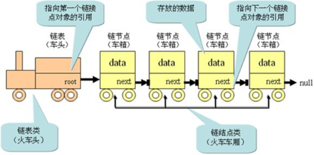

head属性指向链表的第一个节点；  
链表中的最后一个节点指向null；  
当链表中一个节点也没有的时候，head直接指向null；


### 4.2 单向链表的封装

```js
function LinkedList() {
    //内部的类：节点类
    function Node(data) {
        this.data = data;
        this.next = null;
    }
    //属性
    this.head = null;
    this.length = 0;
}
```

### 4.3 链表中常见方法

- append（element）：向链表尾部添加一个新的项；
- insert（position，element）：向链表的特定位置插入一个新的项；
- get（position）：获取对应位置的元素；
- indexOf（element）：返回元素在链表中的索引。如果链表中没有该元素就返回-1；
- update（position，element）：修改某个位置的元素；
- removeAt（position）：从链表的特定位置移除一项；
- remove（element）：从链表中移除一项；
- isEmpty（）：如果链表中不包含任何元素，返回trun，如果链表长度大于0则返回false；
- size（）：返回链表包含的元素个数，与数组的length属性类似；
- toString（）：由于链表项使用了Node类，就需要重写继承自JavaScript对象默认的toString方法，让其只输出元素的值；

#### 4.3.1 append()
```js
LinkedList.prototype.append = data => {
        //1.创建新的节点
        let newNode = new Node(data);

        // 2.判断添加的是否是第一个节点
        if(this.length == 0) {  //2.1 是第一个节点
            this.head = newNode;
        }else {  //2.2 不是第一个节点
            let current = this.head;
            //找到最后一个节点
            while(current.next) {
                current = current.next;
            }
            //最后节点的next指向新的节点
            current.next = newNode;
        }
        //3.lenght+1
        this.length += 1;
    }
```
**过程：**
- 首先链表是否为空，如果为空直接把新的节点插到头结点后面。
- 让current节点指向头结点


- 通过while循环使current遍历到最后一个节点，最后让最后一个节点指向新节点newNode：


**测试：**
```js
let list = new LinkedList();
list.append('123');
list.append('234');
list.append('345');
console.log(list);
```

结果：

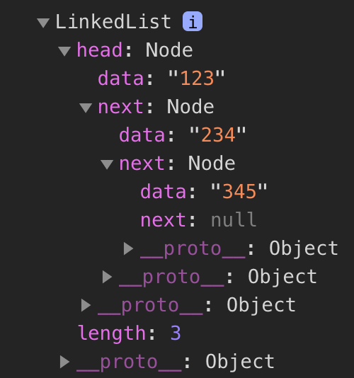

#### 4.3.2 toString()

```js
 LinkedList.prototype.toString = () => {
        //定义变量
        let current = this.head;
        let listString = "";
        while(current) {
            listString += current.data + " ";
            current = current.next;
        }
        return listString;
    }

// 测试：
console.log(list.toString());  //123 234 345 
```

#### 4.3.3 insert()
```js
LinkedList.prototype.insert = (position,data) => {
        //1.对position进行跨界判断
        if(position < 0 || position > this.length) {
            return false;
        }
        // 根据datac创建Node
        let newNode = new Node(data);

        ////判断插入的位置
        if(position == 0) {
            newNode.next = this.head;
            this.head = newNode;          
        }else{
            let index = 0;
            let current = this.head;
            let previous = null;
            while(index < position) {
                previous = current;
                current = current.next;
                index += 1;
            }
            newNode.next = current;
            previous.next = newNode;
        }
        this.length += 1;
        return true;
    }
```

**过程：**
inset方法实现的过程：根据插入节点位置的不同可分为多种情况：
- 情况一：position=0    

通过： newNode.next = this.head，建立连接1；    
通过： this.head = newNode，建立连接2；（不能先建立连接2，否则this.head不再指向Node1）


- 情况二：position>0 || position < length

首先定义两个变量previous和curent分别指向需要插入位置pos = X的前一个节点和后一个节点；       
然后，通过：newNode.next = current，改变指向3；     
最后，通过：previous.next = newNode，改变指向4；

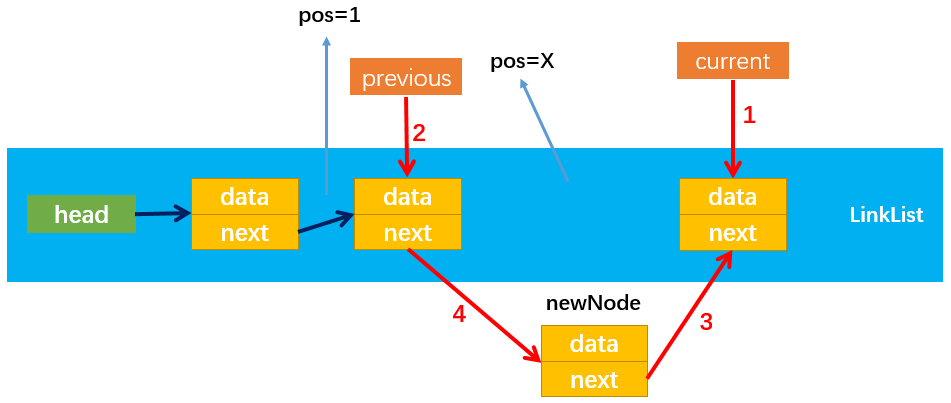

- 情况三：position = length
情况2也包含了pos = length的情况，该情况下current和newNode.next都指向null；建立连接3和连接4的方式与情况2相同。

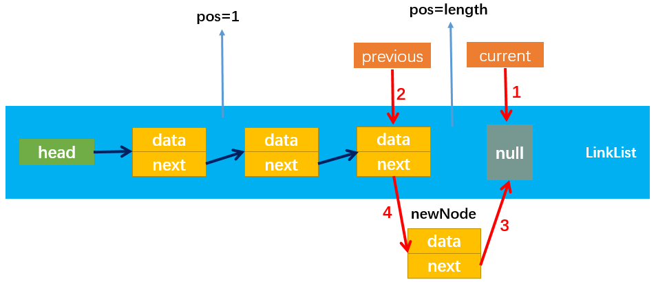

**测试：**
```js
list.insert(0,"000")
console.log(list.toString());  //000 123 234 345 
list.insert(2,"111");
console.log(list.toString());  //000 123 111 234 345 
list.insert(list.length,'333');
console.log(list.toString());  //000 123 111 234 345 333 
```

#### 4.3.4 get(position)
```js

LinkedList.prototype.get = (position) => {
        if(position < 0 || position >= this.length) {
            return null;
        }
        // 获取对应的data
        let current = this.head;
        let index = 0;
        while(index < position) {
            current = current.next;
            index += 1;
        }
        return current.data;
    }
}
```
测试get()方法：
```js
// 测试get方法
console.log(list.get(1));  //123
```

#### 4.3.5 indexOf()方法
```js
LinkedList.prototype.indexOf = (str) => {
        let current = this.head;
        let index = 0;
        while(current.data !== str && index < this.length){
            current = current.next;
            index += 1;
        }
        return index;
    }

// 测试indexOf()
console.log(list.indexOf('333')); //5
```

#### 4.3.6 updata()方法
```js
 LinkedList.prototype.updata = (position,newData) => {
        if(position < 0 || position > this.length) {
            return  false;
        }
        let current = this.head;
        let index = 0;
        while(index++ < position) {
            current = current.next;
        }
        //将position位置的data修改成newData
        current.data = newData;
        return true;
    }

//测试updata()
list.updata(2,"new222");
console.log(list.toString());  //000 123 new222 234 345 333 
```

#### 4.3.7 removeAt()方法

```js
LinkedList.prototype.removeAt = position => {
        if(position < 0 || position >= this.length) {
            return null;
        }
        let current = this.head;
        let index = 0;
        if(position == 0) {  //如果删除第一个元素，就直接把头指针指向下一个元素即可
            this.head = this.head.next;
        }else {
            let previous = null;
            while (index++ < position) {
                previous = current
                current = current.next
              }
            //循环结束后，current指向position后一个节点，previous指向current前一个节点
            //再使前一个节点的next指向current的next即可
            previous.next = current.next
        }
        this.length -- ;
        // 返回删除的节点数据
        return current.data;
    }

//测试removeAt(position)
list.removeAt(2);
console.log(list.toString());
//000 123 234 345 333 
```
removeAt方法的实现过程：删除节点时存在多种情况：

- 情况1：position = 0，即移除第一个节点（Node1）。

通过：this.head = this.head.next，改变指向1即可；

虽然Node1的next仍指向Node2，但是没有引用指向Node1，则Node1会被垃圾回收器自动回收，所以不用处理Node1指向Node2的引用next。


- 情况2：positon > 0，比如pos = 2即移除第三个节点（Node3）。

注意：position = length时position后一个节点为null不能删除，因此position != length；

首先，定义两个变量previous和curent分别指向需要删除位置pos = x的前一个节点和后一个节点；

然后，通过：`previous.next = current.next`，改变指向即可；

随后，没有引用指向Node3，Node3就会被自动回收，至此成功删除Node3 。

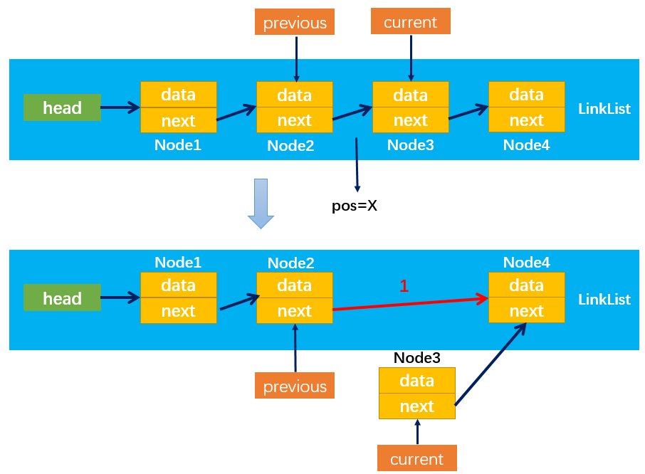

#### 4.3.8 其他方法
```js
      //一.实现remove方法
      LinkList.prototype.remove = (data) => {
        //1.获取data在列表中的位置
        let position = this.indexOf(data)
        //2.根据位置信息，删除结点
        return this.removeAt(position)
      }

      //二.实现isEmpty方法
      LinkList.prototype.isEmpty = () => {
        return this.length == 0
      }

      //三.实现size方法
      LinkList.prototype.size = () => {
        return this.length
      }
```

## 4-2.双向链表

**双向链表：**既可以**从头遍历到尾**，又可以**从尾遍历到头**。也就是说链表连接的过程是双向的，它的实现原理是：一个节点既有向前连接的引用，也有一个向后连接的引用。
**双向链表的缺点**：
- 每次在插入或删除某个节点时，都需要处理四个引用，而不是两个，实现起来会困难些；
- 相对于单向链表，所占内存空间更大一些；
- 但是，相对于双向链表的便利性而言，这些缺点微不足道。

**双向链表的结构：**

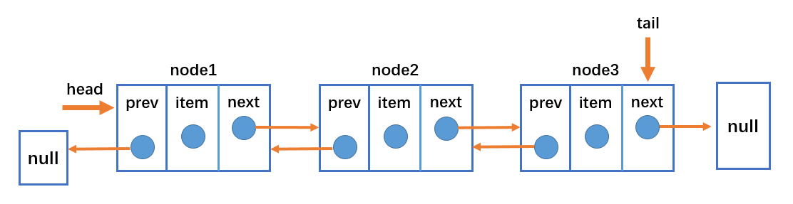

- 双向链表不仅有head指针指向第一个节点，而且有tail指针指向最后一个节点；
- 每一个节点由三部分组成：item储存数据、prev指向前一个节点、next指向后一个节点；
- 双向链表的第一个节点的prev指向null；
- 双向链表的最后一个节点的next指向null；

### 4.1 双向链表常见的操作（方法）

- append（element）：向链表尾部添加一个新的项；
- inset（position，element）：向链表的特定位置插入一个新的项；
- get（element）：获取对应位置的元素；
- indexOf（element）：返回元素在链表中的索引，如果链表中没有元素就返回-1；
- update（position，element）：修改某个位置的元素；
- removeAt（position）：从链表的特定位置移除一项；
- isEmpty（）：如果链表中不包含任何元素，返回trun，如果链表长度大于0则返回false；
- size（）：返回链表包含的元素个数，与数组的length属性类似；
- toString（）：由于链表项使用了Node类，就需要重写继承自JavaScript对象默认的toString方法，让其只输出元素的值；
- forwardString（）：返回正向遍历节点字符串形式；
- backwordString（）：返回反向遍历的节点的字符串形式；

### 4.2 双向链表的封装

```js
function DoublyLinkedList() {

    // 内部类
    function Node(data) {
        this.data = data;
        this.prev = null;
        this.next = null;
    }
    // 属性
    this.head = null;
    this.tail = null;
    this.length = 0;
}
```

#### 4.2.1 append()方法

```js
DoubleLinklist.prototype.aapend(data) {
        //1.创建一个新的节点
        let newNode = new Node(data);
        
        //2。添加节点
        //2.1如果是第一个节点
        if(this.length === 0) {
            this.head = newNode;
            this.tail = newNode;
        }else {
            //2.2如果不是第一个节点
            let current = this.head;

            while(current.next !== null) {
                current = current.next;
            }
            newNode.next =  this.tail.next;
            this.tail.next = newNode;
            newNode.prev = this.tail;
        }
        //3.改变链表的length
        this.length += 1;
    }
```
过程分析：
添加的节点需要考虑多种情况：
- 情况1：添加的是第一个节点：只需要让head和tail都指向新节点即可；


- 情况2：添加的不是第一个节点，如下图所示：只需要改变相关引用的指向即可。

* 通过：`newNode.prev = this.tail`：建立指向1；
* 通过：`this.tail.next = newNode`：建立指向2；
* 通过：`this.tail = newNode`：建立指向3  
要注意改变变量指向的顺序，最后修改tail指向，这样未修改前tail始终指向原链表的最后一个节点。


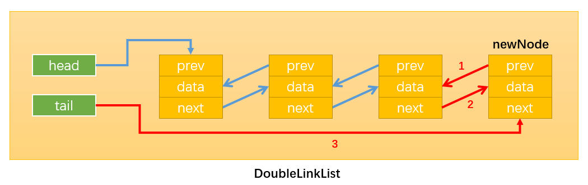

测试：
```js
let list = new DoubleLinklist();
list.append('111');
list.append('222');
list.append('333');
console.log(list);
```
#### 4.2.2 转成字符串方法
```js
// 转成字符串形似方法
    DoubleLinklist.prototype.toString = () => {
        //因为toString方法一般都是从头开始遍历，所以直接调用forwardString方法即可
        return this.backwardString();

    }
    //forwardString方法 向前遍历
    DoubleLinklist.prototype.forwardString = () => {
        let retString = ''
        let current = this.tail;

        if(this.length === 0) {
            return null;
        }
        while(current) {
            retString += current.data + ' ';
            current = current.prev;
        }
        return retString;
    }
    //backwardString方法 向后遍历
    DoubleLinklist.prototype.backwardString = () => {
        let current = this.head;
        let retString = '';  
        
        if(this.length === 0) {
            return null;
        }
        
        while(current) {
            retString += current.data + ' ';
            current = current.next;
        }
        return retString;
    }
```
测试：
```js
console.log(list.toString());  //111 222 333 
console.log(list.forwardString());  //333 222 111 
console.log(list.backwardString()); //111 222 333 
```
#### 4.2.3 插入方法 insert

```js
DoubleLinklist.prototype.insert = (position,data) => {
        //跨界判断
        if(position < 0 || position > this.length) {
            return false;
        }
        //插入新节点
        let newNode = new Node(data);
        //1.如果插入的节点在表头
        if(this.length == 0) {
            this.head = newNode;
            this.tail = newNode;
            //2.插入表末尾
        } else if (position == this.length) {
            this.tail.next = newNode;
            newNode.prev = this.tail;
            this.tail = newNode;
        } else { //3.插入表中间
            let current = this.head;
            let index = 0;

            while(index++ < position) {
                current = current.next;
            }
            newNode.prev = current.prev;
            current.prev.next = newNode;
            current.prev = newNode;
            newNode.next = current;
        }
    }
```

过程分析：
插入节点可分为多种情况：

**当原链表为空时：**

- 情况1：插入的新节点是链表的第一个节点；只需要让head和tail都指向newNode即可。

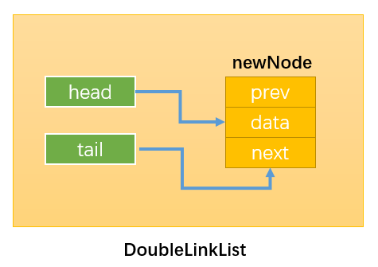

**当原链表不为空时：**

- 情况2：当position == 0，即在链表的首部添加节点：如下图所示：

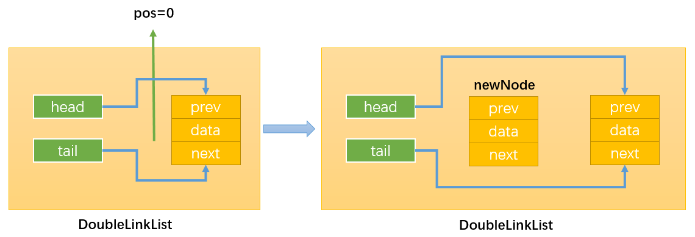

首先，通过：`this.head.prev = newNode`，改变指向1；

然后，通过：`newNode.next = this.head`，改变指向2；

最后，通过：`this.head = newNode`，改变指向3；


- 情况3：`position == this.length`，即在链表的尾部添加节点，如下图所示：


首先，通过：`this.tail.next = newNode`，改变指向1；（注意这里使用this.tail指向原链表最后一个节点，而不是`this.head`。因为当`length>1`时，`this.head != this.tail`。）

然后，通过：`newNode.prev = this.tail`，改变指向2；

最后，通过：`this.tail = newNode`，改变指向3；


- 情况4：0 < position < this.length，即在链表的中间插入新节点，假设在position = 1的位置插入，如下图所示：

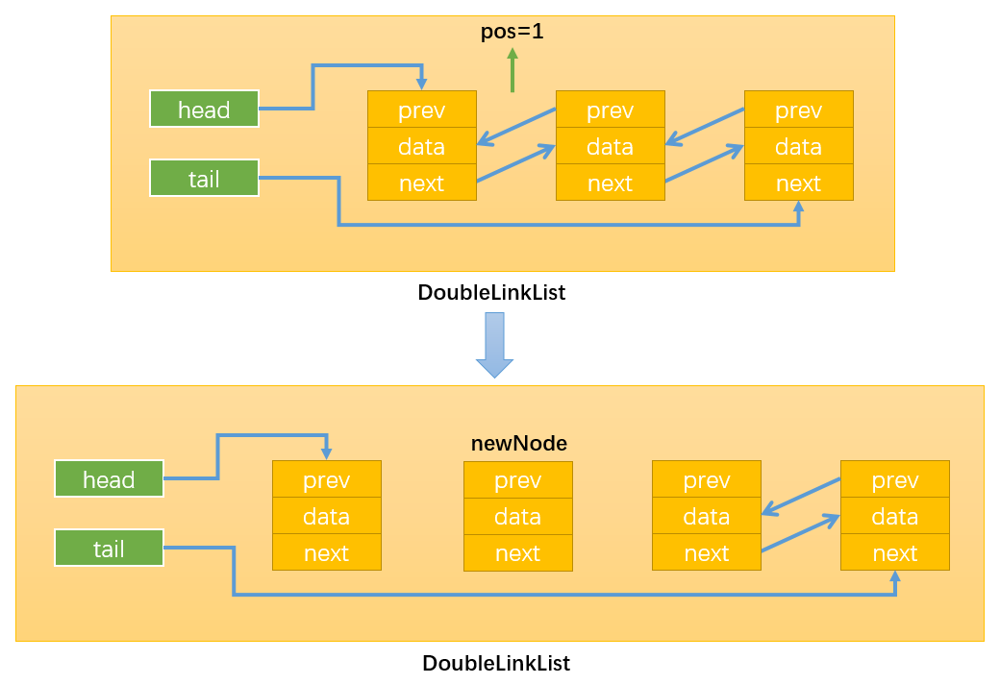

首先，需要定义变量current按照之前的思路，通过while循环找到position位置的后一个节点，循环结束后`index = position`

如下图所示：当position = 1时，current就指向了Node2。这样操作current就等同于间接地操作Node2，还可以通过current.prev间接获取Node1。得到了newNode的前一个节点和后一个节点就可以通过改变它们的prev和next变量的指向来插入newNode了。

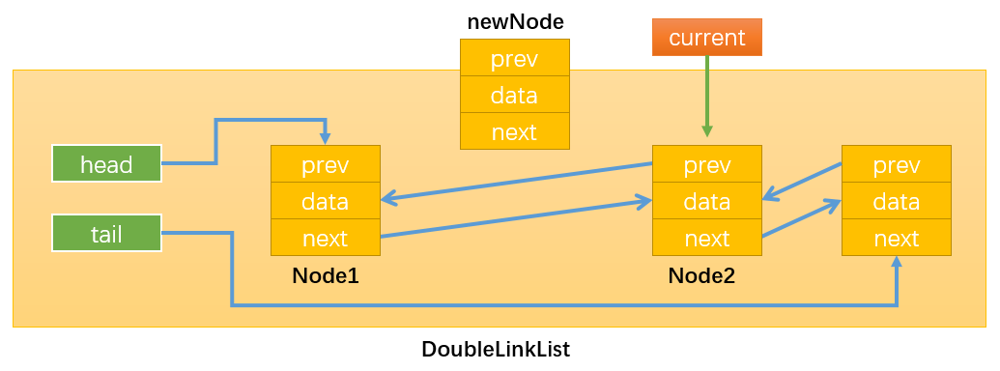

通过：`newNode.next = current`，改变指向1；

通过：`newNode.prev = current.prev`，改变指向2；

通过：`current.prev.next = newNode`，改变指向3；

注意必须最后才修改`current.prev`的指向，不然就无法通过`current.prev`获取需要操作的Node1了。

通过：`current.prev = current`，改变指向4；


**测试：**
```js
list.insert(2,'00000');
list.insert(0,'插在链表的头部');
list.insert(list.length,'插在链表的尾部');
console.log(list.toString());

```

`**结果：**`        
`插在链表的头部 111 222 00000 333 插在链表的尾部 `

#### 4.2.4 get(position)
```js
DoubleLinklist.prototype.get = (position) => {
        //越界判断
        if(position < 0 || position >= this.length) {
            return null;
        }
        //获取元素
        let current = this.head;
        let index = 0;
        while(index < position) {
            current = current.next;
            index ++;
        }
        return current.data;
    }
```
测试：
```
console.log(list.get(3));  //00000
```

#### 4.2.5 indexOf方法实现
```js
DoubleLinklist.prototype.indexOf = (data) => {
        let current = this.head;
        let index = 0;

        while(current) {
            if(current.data === data) {
                return index;
            }
            current = current.next;
            index ++;
        }
        return -1;  //找不到
    }
```
测试：
```js
console.log(list.indexOf('00000'));  //3
```

#### 4.2.6 update(position,element)
```js
DoubleLinklist.prototype.updata = (position,newData) => {
        //越界判断
        if(position < 0 || position >= this.length) {
            return false;
        }
        let current = this.head;
        let index = 0;
        while(index < position) {
            current = current.next;
            index ++;
        }
        current.data = newData;
        return true;
    }
```
测试：
```js
list.updata(3,'aaa');
console.log(list.toString()); 
//插在链表的头部 111 222 00000 333 插在链表的尾部 
```

#### 4.2.7 removeAt(position)
```js
DoubleLinklist.prototype.removeAt = (position) => {
        //越界判断
        if(position < 0 || position > this.length) {
            return null;
        }
        let current = this.head; 
        //链表中只有一个元素
        if(this.length === 0) {
            this.head = null;
            this.tail = null;
        }else {
            //判断是否删除的是第一个元素
            if(position == 0) {
                this.head.next.prev = null;
                this.head = this.head.next;
            }else if(position == this.length - 1){  //删除最后一个节点
                current = this.tail;  //接受被返回的删除的节点
                this.tail.prev.next = null;
                this.tail = current.prev;
            } else { //删除中间的节点
                let index = 0;
                while(index < position) {
                    current = current.next;
                    index += 1;
                }
                current.prev.next = current.next;
                current.next.prev = current.prev;
            }
        }
        this.length --;
        return current.data;
    }
```

**过程详解：**

删除节点时有多种情况：

**当链表的length = 1时:**

- 情况1：删除链表中的所有节点：只需要让链表的head和tail指向null即可。

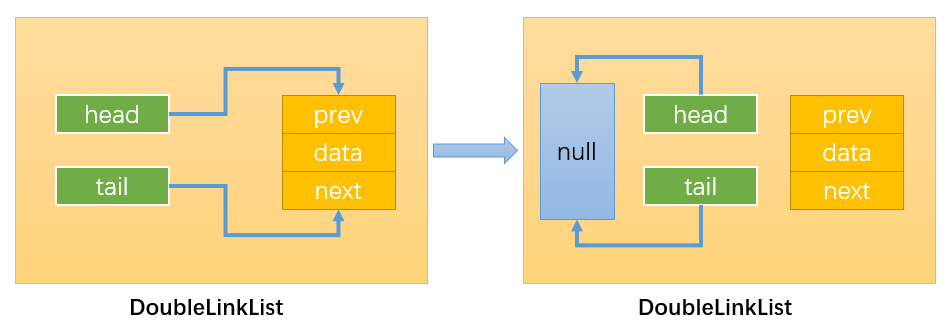

**当链表的length > 1时：**

- 情况2：删除链表中的第一个节点：

通过：`this.head.next.prev = null`，改变指向1；

通过：`this.head = this.head.next`，改变指向2；

虽然Node1有引用指向其它节点，但是没有引用指向Node1，那么Node1会被自动回收。

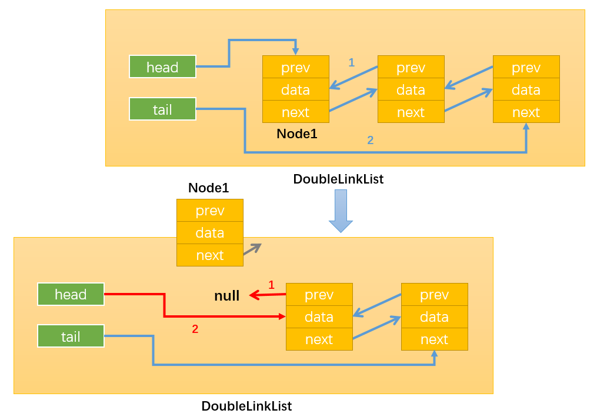

- 情况3：删除链表中的最后一个节点：

通过：`this.tail.prev.next = null`，修改指向1；

通过：`this.tail = this.tail.prev`，修改指向2；

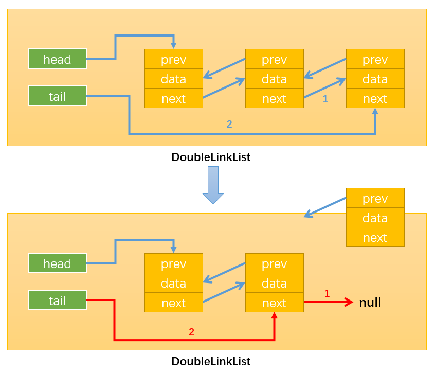

- 情况4：删除链表中间的节点：

通过while循环找到需要删除的节点，比如position = x，那么需要删除的节点就是Node(x+1)，如下图所示：


通过：`current.next.prev = current.prev`，修改指向1；

通过：`current.prev.next = current.next`，修改指向2；

这样就没有引用指向Node(x+1)了（current虽指向Node(x+1)，但current时临时变量，该方法执行完就会被销毁），随后Node(x+1)就会被自动删除。


**测试**

```js
let re = list.removeAt(3);
console.log("删除的节点是：" + re);
console.log(list.toString());
// 删除的节点是：00000
//插在链表的头部 111 222 333 插在链表的尾部 
```

#### 4.2.8 其他方法
其他方法包括：remove(element)、isEmpty()、size()、getHead()、getTail()

```js

    //remove()
    DoubleLinklist.prototype.remove = () =>  {
        //找到data的索引
        let index = this.indexOf(data);

        //删除这个索引位置对应的元素
        this.removeAt(index);

        return index;
    }

    //isEmpty()
    DoubleLinklist.prototype.isEmpty = () => {
        return this.length === 0;
    }
    //size()
    DoubleLinklist.prototype.size = () => {
         return this.length;
    }
    //getHead()
    DoubleLinklist.prototype.getHead = () => {
        return this.head.data;
    }
    //getTail() 
    DoubleLinklist.prototype.getTail = () => {
        return this.tail.data;
    }
```
