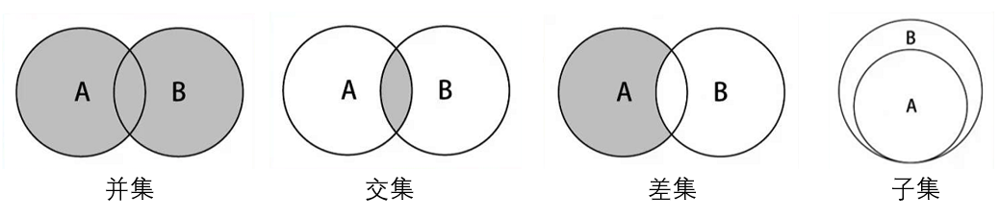

## 5.集合结构
几乎每种编程语言中，都有集合结构。集合比较常见的实现方式是哈希表，这里使用 JavaScript 的 Object 进行封装。

### 5.1 集合的特点
- 集合通常是由一组无序的、不能重复的元素构成。

- 数学中常指的集合中的元素是可以重复的，但是计算机中集合的元素不能重复。
- 集合是特殊的数组。

    * 特殊之处在于里面的元素没有顺序，也不能重复。
    * 没有顺序意味着不能通过下标值进行访问，不能重复意味着相同的对象在集合中只会存在一份。

### 5.2 封装集合
ES6 中的 Set 就是一个集合类，这里我们重新封装一个 Set 类，了解集合的底层实现。

#### 5.2.1 集合常见的操作
- `add(value) `向集合添加一个新的项。
- `remove(value`) 从集合移除一个值。
- `has(value) `如果值在集合中，返回 true，否则返回 false。
- `clear()` 移除集合中的所有项。
- `size() `返回集合所包含元素的数量。与数组的 length 属性类似。
- `values() `返回一个包含集合中所有值的数组。
还有其他的方法，用的不多，这里不做封装。

#### 5.2.2 集合封装代码实现
```js
//集合结构的封装
class Set {
    constructor() {
        this.items = [];
    }

    //has(value)判断集合中是否存在value这个属性，存在返回true，否则返回false
    has(value) {
        return this.items.hasOwnProperty(value); //hasOwnProperty检测一个属性是否是自身的属性而不是原型的属性
    };

    //add(value) 往集合中添加value
    add(value) {
        // 首先检测集合中是否包含这个属性（值）
        if(this.has(value)) {
            return false;
        }
        this.items[value] = value; //属性名和值都是value
        return true;
    }

    //remove(value) 删除集合中指定的value
    remove(value) {
        //如果集合中不存在这个value，则范湖false
        if(!this.has(value)) {
            return false;
        }
        delete this.items[value];
    }

    //clear()情况所有的value
    clear() {
        this.items = {};
    }

    //size() 返回集合中value的个数
    size() {
        return Object.keys(this.items).length;
    }

    //values() 获取集合中所有的value
    values() {
        return Object.keys(this.items);
    }
}
```

**代码测试：**
```js
const set = new Set();
// add()测试
set.add('111');
set.add('222');
set.add('333');
set.add('444');

//values()测试
console.log(set.values());  //[ '111', '222', '333', '444' ]

//has()测试
console.log(set.has('222')); //true
console.log(set.has('000'));  //false

// size()和remove()测试
console.log(set.size());  //4
set.remove('222');
console.log(set.size());  //3
console.log(set.values());  //[ '111', '333', '444' ]

//clear()测试
set.clear()
console.log(set.values());  // []
```

### 5.3 集合间的操作
- 并集：对于给定的两个集合，返回一个包含两个集合中所有元素的新集合。
- 交集：对于给定的两个集合，返回一个包含两个集合中共有元素的新集合。
- 差集：对于给定的两个集合，返回一个包含所有存在于第一个集合且不存在于第二个集合的元素的新集合。
- 子集：验证一个给定集合是否是另一个集合的子集。



#### 5.3.1 集合并集的实现
- 并集的实现
```js
    union(otherSet) {
        //1.创建一个新的集合
        let newSet = new Set();

        //2.将当前集合的value添加到新集合newSet中
        for(let value of this.values()) {
            newSet.add(value);
        } 

        //3.将otherSet集合中的所有value，添加到新集合newSet中
        for(let value of otherSet.values()) {
            newSet.add(value);  //这里add已经有重复判断了
        }
        return  newSet;
    }
```

- 交集实现
```js
    intersection(otherSet) {
        //创建一个新的集合
        let newSet = new Set();

        //从当前集合中选出每个元素都判断在otherSet中是否存在
        for(let value of this.values()) {
            if(otherSet.has(value)) {
                newSet.add(value);
            }
        }
        return newSet;
    }
```
- 差集实现
```js
    difference(otherSet) {
        //创建一个新集合
        let newSet = new Set();

        //从当前集合中取出每一个value，判断是否在otherSet集合中存在，不存在的就是差集
        for(let value of this.values()) {
            if(!otherSet.has(value)) {
                newSet.add(value);
            }
        }
        return newSet;
    }
```

- 子集的实现

```js
    subset(otherSet) {
        //从当前集合中取出每一个value判断是否在otherSet集合中存在，有不存在的返回false
        //如果能遍历完所有的，说明就是自己，返回true
        for(let value of this.values()) {
            if(!otherSet.has(value)) {
                return false;
            }
            return true;
        }
    }
```

**测试：**
```js
set = ['111','222','333','444']
otherSet = ['aaa','bbb','ccc','222']

console.log(set.union(otherSet).values()); 
//  ["111", "222", "333", "444", "aaa", "bbb", "ccc"]

console.log(set.intersection(otherSet).values());  //["333"]

console.log(set.difference(otherSet).values());  //["111", "222", "444"]

console.log(set.subset(otherSet));  //false
```
