## 8.1 JavaScript实现树结构
### 8.1.1 树结构的特点
- 树一般都有一个跟，连接着根的是树干。
- 树干会发生分叉，形成许多树枝，树枝会继续分化成更小的树枝。
- 树枝的最后是叶子

**树结构对比于数组/链表/哈希表有哪些优势呢：**

- 数组：

优点：可以通过下标值访问，效率高；  
缺点：查找数据时需要先对数据进行排序，生成有序数组，才能提高查找效率；并且在插入和删除元素时，需要大量的位移操作；

- 链表：

优点：数据的插入和删除操作效率都很高；  
缺点：查找效率低，需要从头开始依次查找，直到找到目标数据为止；当需要在链表中间位置插入或删除数据时，插入或删除的效率都不高。

- 哈希表：

优点：哈希表的插入/查询/删除效率都非常高；
缺点：空间利用率不高，底层使用的数组中很多单元没有被利用；并且哈希表中的元素是无序的，不能按照固定顺序遍历哈希表中的元素；而且不能快速找出哈希表中最大值或最小值这些特殊值。

- 树结构：

优点：树结构综合了上述三种结构的优点，同时也弥补了它们存在的缺点（虽然效率不一定都比它
们高），比如树结构中数据都是有序的，查找效率高；空间利用率高；并且可以快速获取最大值和最小值等。

总的来说：每种数据结构都有自己特定的应用场景

## 8.2二叉树
**二叉树的概念：**如果树中的每一个节点最多只能由两个子节点，这样的树就称为二叉树；

二叉树十分重要，不仅仅是因为简单，更是因为几乎所有的树都可以表示成二叉树形式。

**二叉树的组成：**

二叉树可以为空，也就是没有节点；    
若二叉树不为空，则它由根节点和称为其左子树TL和右子树TR的两个不相交的二叉树组成；
二叉树的五种形态：

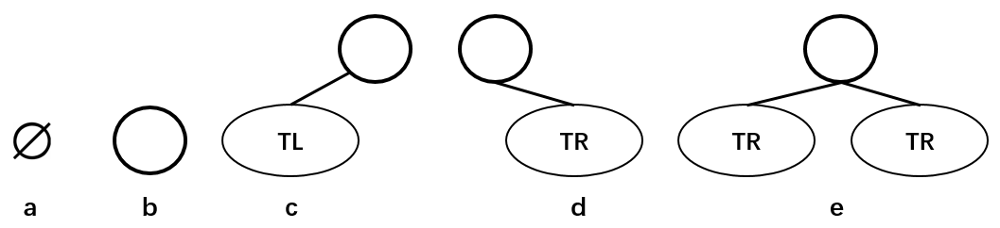

上图分别表示：空的二叉树、只有一个节点的二叉树、只有左子树TL的二叉树、只有右子树TR的二叉树和有左右两个子树的二叉树。

### 8.2.1 二叉树的特性

- 一个二叉树的第 i 层的最大节点树为：2^(i-1)^，i >= 1；   
- 深度为k的二叉树的最大节点总数为：2^k^ - 1 ，k >= 1；    
- 对任何非空二叉树，若 n~0~ 表示叶子节点的个数，n~2~表示度为2的非叶子节点个数，那么两者满足关系：n~0~ = n~2~ + 1；如下图所示：H，E，I，J，G为叶子节点，总数为5；A，B，C，F为度为2的非叶子节点，总数为4；满足n~0~ = n~2~ + 1的规律。

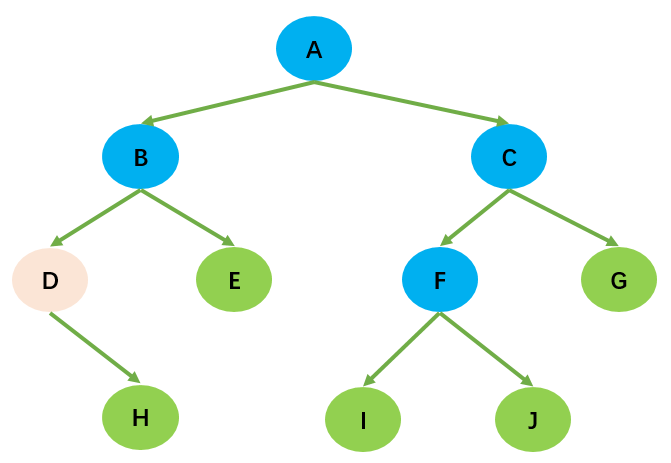

### 8.2.2 特殊的二叉树
#### 8.2.2.1 完全二叉树

除了二叉树最后一层外，其他各层的节点数都达到了最大值；
并且，最后一层的叶子节点从左向右是连续存在，只缺失右侧若干叶子节点；
完美二叉树是特殊的完全二叉树；

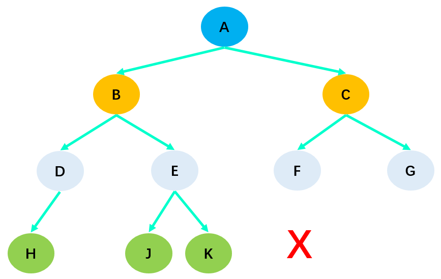

在上图中，由于H缺失了右子节点，所以它不是完全二叉树。

2.3.二叉树的数据存储
常见的二叉树存储方式为数组和链表：

使用数组：

- 完全二叉树：按从上到下，从左到右的方式存储数据。

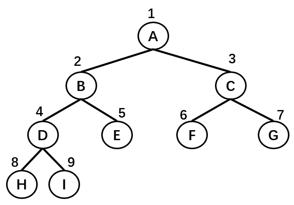

| 节点 | A | B | C | D | E | F | G | H |
| :-----| ----: | :----: | :----: | :----: | :-----| ----: | :----: | :----: |
| 序号 | 1 | 2 | 3 | 4 | 5 | 6 | 7 | 8 |

使用数组存储时，取数据的时候也十分方便：左子节点的序号等于父节点序号 * 2，右子节点的序号等于父节点序号 * 2 + 1 。

- 非完全二叉树：非完全二叉树需要转换成完全二叉树才能按照上面的方案存储，这样会浪费很大的存储空间。

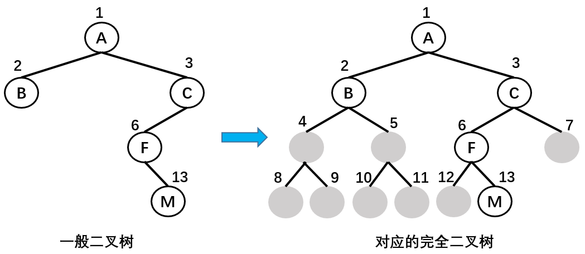

**使用链表**

二叉树最常见的存储方式为链表：每一个节点封装成一个Node，Node中包含存储的数据、左节点的引用和右节点的引用。

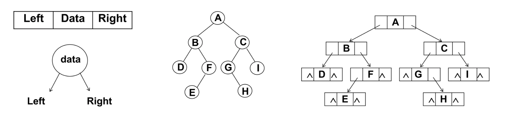

#### 8.2.2.1 二叉搜索树

**认识二叉搜索树**
二叉搜索树（BST，Binary Search Tree），也称为二叉排序树和二叉查找树。

二叉搜索树是一棵二叉树，可以为空；

如果不为空，则满足以下性质：

- 条件1：非空左子树的所有键值小于其根节点的键值。比如三中节点6的所有非空左子树的键值都小于6；
- 条件2：非空右子树的所有键值大于其根节点的键值；比如三中节点6的所有非空右子树的键值都大于6；
- 条件3：左、右子树本身也都是二叉搜索树；

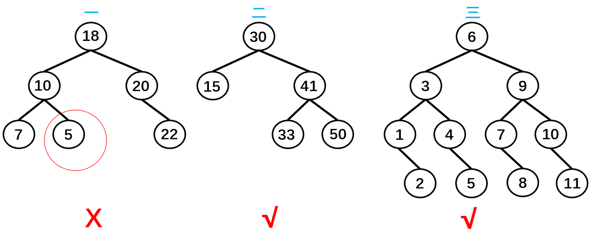

如上图所示，树二和树三符合3个条件属于二叉树，树一不满足条件3所以不是二叉树。

总结：二叉搜索树的特点主要是较小的值总是保存在左节点上，相对较大的值总是保存在右节点上。这种特点使得二叉搜索树的查询效率非常高，这也就是二叉搜索树中"搜索"的来源。

### 8.2.3 二叉搜索树应用举例
下面是一个二叉搜索树：

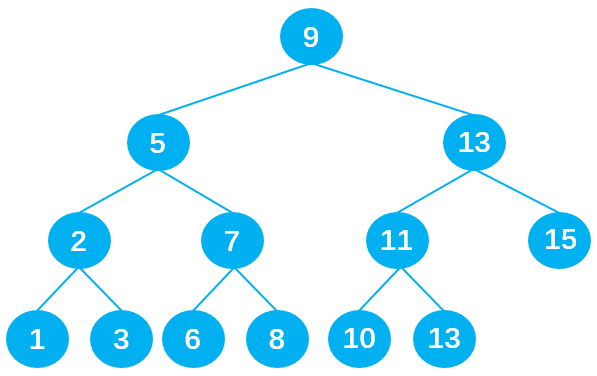

若想在其中查找数据10，只需要查找4次，查找效率非常高。

第1次：将10与根节点9进行比较，由于10 > 9，所以10下一步与根节点9的右子节点13比较；
第2次：由于10 < 13，所以10下一步与父节点13的左子节点11比较；
第3次：由于10 < 11，所以10下一步与父节点11的左子节点10比较；
第4次：由于10 = 10，最终查找到数据10 。

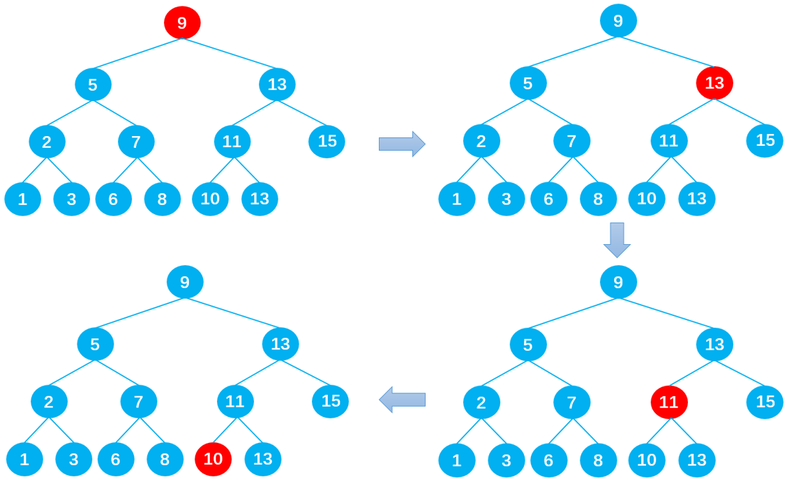

同样是15个数据，在排序好的数组中查询数据10，需要查询10次：

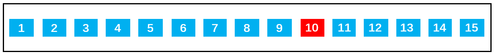

其实：如果是排序好的数组，可以通过二分查找：第一次找9，第二次找13，第三次找15...。我们发现如果把每次二分的数据拿出来以树的形式表示的话就是二叉搜索树。这就是数组二分法查找效率之所以高的原因。

## 8.3 二叉树的封装

**二叉搜索树的基本属性**

如图所示：二叉搜索树有四个基本的属性：指向节点的根，节点中的键，左指针，右指针。


所以，二叉搜索树中除了定义root属性外，还应定义一个节点内部类，里面包含每个节点中的left、right和key三个属性：

```js
//封装二叉搜索树
function BinarySearchTree() {
    //节点内部类
    function Node(key){
      this.key = key
      this.left = null
      this.right = null
    }

    //属性
    this.root = null;
}
```

**二叉搜索树的常见操作**
- insert（key）：向树中插入一个新的键；
- search（key）：在树中查找一个键，如果节点存在，则返回true；如果不存在，则返回false；
- inOrderTraverse：通过中序遍历方式遍历所有节点；
- preOrderTraverse：通过先序遍历方式遍历所有节点；
- postOrderTraverse：通过后序遍历方式遍历所有节点；
- min：返回树中最小的值/键；
- max：返回树中最大的值/键；
- remove（key）：从树中移除某个键；

### 8.3.1 insert() 插入数据
**实现思路：**
- 首先根据传入的key创建节点对象；
- 然后判断根节点是否存在，不存在时通过：this.root = newNode，直接把新节点作为二叉搜索树的根节点。
- 若存在根节点则重新定义一个内部方法insertNode（）用于查找插入点。

```js
    //一.插入数据：insert方法:对外向用户暴露的方法
    BinarySearchTree.prototype.insert = function(key){
      //1.根据key创建节点
      let newNode = new Node(key)
        
      //2.判断根节点是否存在
      if (this.root == null) {
        this.root = newNode
        //根节点存在时
      }else {
        this.insertNode(this.root, newNode)
      }
    }

    //内部使用的insertNode方法:用于比较节点从左边插入还是右边插入
    BinarySearchTree.prototype.insertNode = function(node, newNode){
      //当newNode.key < node.key向左查找
      if(newNode.key < node.key){
        //情况1：node无左子节点，直接插入
        if (node.left == null) {
          node.left = newNode
        //情况2：node有左子节点，递归调用insertNode(),直到遇到无左子节点成功插入newNode后，不再符合该情况，也就不再调用insertNode()，递归停止。
        }else{
          this.insertNode(node.left, newNode)
        }
      //当newNode.key >= node.key向右查找
      }else{
        //情况1：node无右子节点，直接插入
        if(node.right == null){
          node.right = newNode
        //情况2：node有右子节点，依然递归调用insertNode(),直到遇到无右子节点成功插入newNode为止
        }else{
          this.insertNode(node.right, newNode)
        }
      }
    }
```

**内部方法insertNode（）的实现思路:**

根据比较传入的两个节点，一直查找新节点适合插入的位置，直到成功插入新节点为止。

当newNode.key < node.key向左查找:

- 情况1：当node无左子节点时，直接插入：

- 情况2：当node有左子节点时，递归调用insertNode(),直到遇到无左子节点成功插入newNode后，不再符合该情况，也就不再调用insertNode()，递归停止。


当newNode.key >= node.key向右查找，与向左查找类似：

- 情况1：当node无右子节点时，直接插入：

- 情况2：当node有右子节点时，依然递归调用insertNode(),直到遇到传入insertNode方法的node无右子节点成功插入newNode为止：


**代码测试**
```js
let bst = new BinarySearchTree()

//2.插入数据
bst.insert(11);
bst.insert(7);
bst.insert(15);
bst.insert(5);
bst.insert(9);
console.log(bst);
```
应该得到下面这个树：

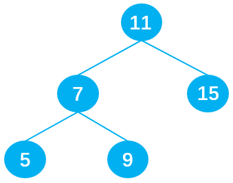

### 8.3.2 二叉树的遍历
这里所说的树的遍历不仅仅针对二叉搜索树，而是适用于所有的二叉树。由于树结构不是线性结构，所以遍历方式有多种选择，常见的三种二叉树遍历方式为：

- 先序遍历；
- 中序遍历；
- 后序遍历；

#### （1）先序遍历

先序遍历的过程为：

- 首先，遍历根节点；
- 然后，遍历其左子树；
- 最后，遍历其右子树；

如上图所示，二叉树的节点遍历顺序为：`A -> B -> D -> H -> I -> E -> C -> F -> G`。

**代码实现：**

```js
	  //先序遍历
      //掺入一个handler函数方便之后对得到的key进行处理
      BinarySearchTree.prototype.preOrderTraversal = function(handler){
        this.preOrderTraversalNode(this.root, handler)
      }

      //封装内部方法，对某个节点进行遍历
      BinarySearchTree.prototype.preOrderTraversalNode = function(node,handler){
        if (node != null) {
          //1.处理经过的节点
          handler(node.key)

          //2.遍历左子树中的节点
          this.preOrderTraversalNode(node.left, handler)
          
          //3.遍历右子树中的节点
          this.preOrderTraversalNode(node.right, handler)
        }
      }

```

**过程详解：**

以遍历以下二叉搜索树为例：

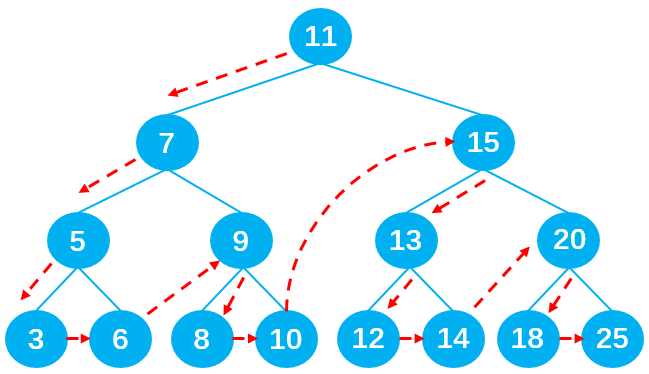

首先调用preOrderTraversal方法，在方法里再调用preOrderTraversalNode方法用于遍历二叉搜索树。在preOrderTraversalNode方法中，递归1负责遍历左子节点，递归2负责遍历右子节点。先执行递归1，执行过程如下图所示：

*记：preOrderTraversalNode() 为 A()*

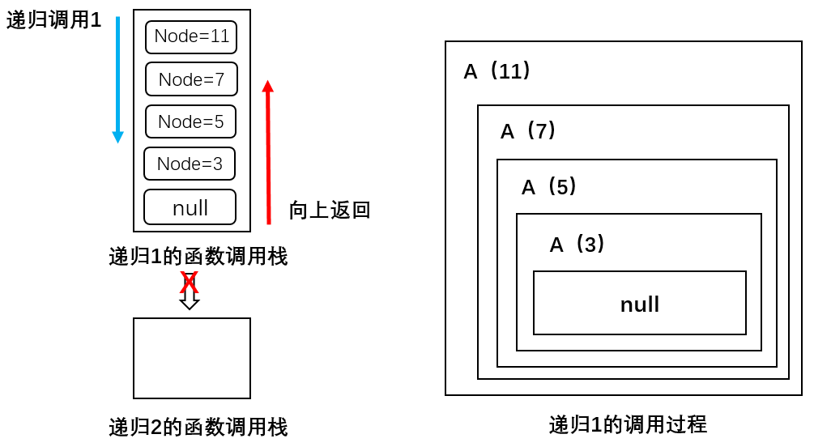

可以看到一共递归调用了4次方法A，分别传入11、7、5、3，最后遇到null不满足 node != null 条件结束递归1；注意此时只是执行完最开始的递归1，并没有执行递归2，并且递归1执行到null停止后要一层层地往上返回，按顺序将调用的函数压出函数调用栈。

关于函数调用栈：之前的四次递归共把4个函数压入了函数调用栈，现在递归执行完了一层层地把函数压出栈。

值得注意的是：每一层函数都只是执行完了递归1，当返回到该层函数时，比如A（3）要继续执行递归2遍历二叉搜索树中的右子节点；

在执行递归2的过程中会不断调用方法A，并依次执行递归1和递归2，以此类推直到遇到null不满足 node != null 条件为止，才停止递归并一层层返回，如此循环。同理A（5）层、A（7）层、A（11）层都要经历上述循环，直到将二叉搜索树中的节点全部遍历完为止。

具体过程如下图所示：

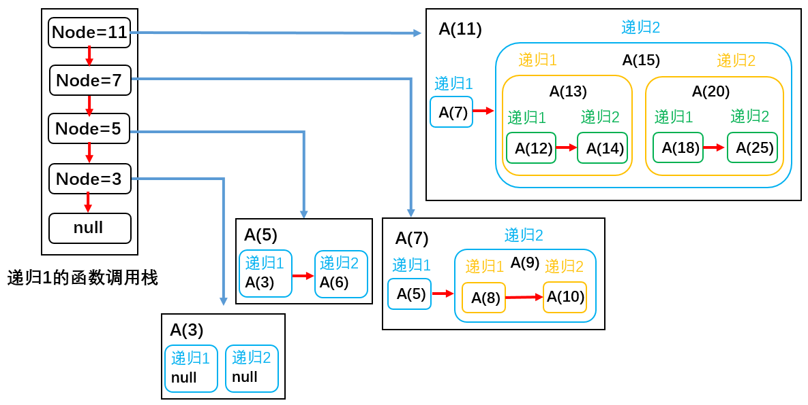

**测试代码**

```js
    //测试代码
    //1.创建BinarySearchTree
    let bst = new BinarySearchTree()

    //2.插入数据
    bst.insert(11);
    bst.insert(7);
    bst.insert(15);
    bst.insert(5);
    bst.insert(3);
    bst.insert(9);
    bst.insert(8);
    bst.insert(10);
    bst.insert(13);
    bst.insert(12);
    bst.insert(14);
    bst.insert(20);
    bst.insert(18);
    bst.insert(25);
    bst.insert(6);
    
    let resultString = ""
    //掺入处理节点值的处理函数
    bst.preOrderTraversal(function(key){
      resultString += key + " "
    })
    console.log(resultString)
```
结果：
`11 7 5 3 6 9 8 10 15 13 12 14 20 18 25 `

#### （2）中序遍历

实现思路：与先序遍历原理相同，只不过是遍历的顺序不一样了。

- 首先，遍历其左子树；
- 然后，遍历根（父）节点；
- 最后，遍历其右子树；

**代码实现：**

```js
      //中序遍历
      BinarySearchTree.prototype.midOrderTraversal = function(handler){
        this.midOrderTraversalNode(this.root, handler)
      }

      BinarySearchTree.prototype.midOrderTraversalNode = function(node, handler){
        if (node != null) {
          //1.遍历左子树中的节点
          this.midOrderTraversalNode(node.left, handler)
          
          //2.处理节点
          handler(node.key)

          //3.遍历右子树中的节点
          this.midOrderTraversalNode(node.right, handler)
        }
      }
```
**测试代码**
```js
let resultString2 =""
bst.midOrderTraversal(function(key){
  resultString2 += key + " "
})
console.log(resultString2);

// 结果：3 5 6 7 8 9 10 11 12 13 14 15 18 20 25 
```

#### （3）后续遍历 
实现思路：与先序遍历原理相同，只不过是遍历的顺序不一样了。

- 首先，遍历其左子树；
- 然后，遍历其右子树；
- 最后，遍历根（父）节点；

**代码实现**
```js
      //后序遍历
      BinarySearchTree.prototype.postOrderTraversal = function(handler){
        this.postOrderTraversalNode(this.root, handler)
      }

      BinarySearchTree.prototype.postOrderTraversalNode = function(node, handler){
        if (node != null) {
          //1.遍历左子树中的节点
          this.postOrderTraversalNode(node.left, handler)
          
          //2.遍历右子树中的节点
          this.postOrderTraversalNode(node.right, handler)

          //3.处理节点
          handler(node.key)
        }
      }
```
**测试代码**
```js
let resultString3 = "";
bst.postOrderTraversal(function(key) {
    resultString3 += key + " ";
})
console.log(resultString3);

// 结果：3 6 5 8 10 9 7 12 14 13 18 25 20 15 11 
```

### 8.3.3 二叉树的查找

#### 8.3.3.1 查找最大值或最小值

 在二叉搜索树中查找最值非常简单，最值在二叉搜索树的最左边，最大值在二叉树的最右边，只需要一直向左/向右查找就能得到最值，如下如所示：

 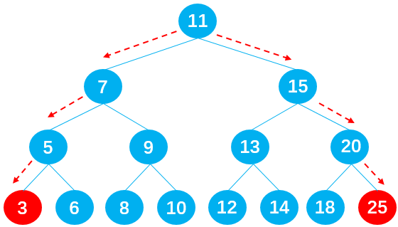

 ```js
    //查找最大值
    BinarySearchTree.prototype.max = () => {
      //获取根节点
      let node = this.root;

      //定义key保存节点值
      let key = null;
      while(node != null) {
        key = node.key;
        node = node.right;
      }
      return key;
    }
    //查找最小值
    BinarySearchTree.prototype.min = () => {
      let node = this.root;

      let key = null;
      while(node != null) {
        key = node.key;
        node = node.left;
      }
      return key;
    }

  //最大值和最小值测试
console.log("max:" + bst.max() );  //max:25
console.log("min:" + bst.min());  //min:3
 ```
 #### 8.3.3.2 查找特定值

 查找二叉搜索树当中的特定值效率也非常高，只需要从根节点开始讲需要查找节点的key值要查找的值比较，如果`node.key > root`则向右查找，如果 `node.key < root` 则向左查找。直到找到与该key值相等或者null为止。可以使用递归也可以使用循环来实现。

 ```js
    BinarySearchTree.prototype.search = (key) => {
      //获取节点
      let node = this.root;

      //循环搜索key
      while(node != null) {
        // 向左查找
        if(node.key > key) {
          node = node.left;
        }else if(node.key < key) {
          node = node.right;
        }else {
          return true;
        }
      }
      return false;
    }
  
  //测试：
  console.log(bst.search(20)); //true
 ```

 ### 8.3.4 二叉树删除节点
 - 第一步：先找到需要删除的节点，若没找到，则不需要删除，直接返回false。
 
 ```js
    //删除节点
    BinarySearchTree.prototype.delete = (key) => {
      //1.定义变量
      let current = this.root;  //你保存之后需要删除的节点
      let parent = null;        //保存删除节点的父节点
      let isLeftChild = true;  // 判断是否为parent的左节点

      //开始寻找删除的节点
      while(current,key != key) {
        parent = current;
        //往左边查找
        if(current.key > key) {
          isLeftChild = true;
          current = current.left;
        }else {
          isLeftChild = false;
          current = current.right;
        }

        //找到最后一个节点仍然没有找到
        if(current == null) {
          return false;
        }
      }
      // 结束循环，此时current.key == key
 ```
 - 删除指定的节点，分三种情况
  * 删除叶子节点
  * 删除只有一个子节点的节点
  * 删除有两个子节点的节点

#### 8.3.4.1 删除没有子节点的节点

没有子节点的也有两种情况

当该叶子节点为根节点时，如下图所示：此时`current== this.root`,直接通过`this.root = null` 即可删除.

当该叶子节点不是跟节点的时候，如下如所示：

 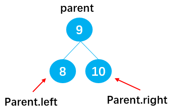

1） 若`current = 8`，可以通过：`parent.left = null`，删除节点8；

2） 若`current = 10`，可以通过：`parent.right = null`，删除节点8；

**代码实现**
```js
      //情况1：删除的叶子节点
      if(current.left == null && current.right == null) {
        //判断该叶子节点是否是根节点
        if(current == this.root) {
          this.root = null;
        }else if(isLeftChild) {
          parent.left = null;
        }else {
          parent.right = null;
        }
      }
```

#### 8.3.4.2 有一个叶子节点

**有六种情况，分别是：**

- 情况1：current为根节点（`current == this.root`），如节点11，此时通过：`this.root = current.left`，删除根节点11；

情况2：current为父节点parent的左子节点（`isLeftChild == true`），如节点5，此时通过：`parent.left = current.left`，删除节点5；

情况3：current为父节点parent的右子节点（`isLeftChild == false`），如节点9，此时通过：`parent.right = current.left`，删除节点9；

 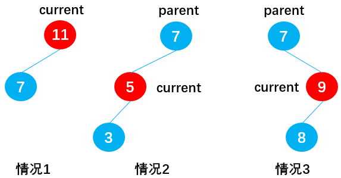

当current存在右子节点时（current.left = null）：

- 情况4：current为根节点（`current == this.root`），如节点11，此时通过：`this.root = current.right`，删除根节点11。

- 情况5：current为父节点parent的左子节点（i`sLeftChild == true`），如节点5，此时通过：parent.left = current.right，删除节点5；

- 情况6：current为父节点parent的右子节点（`isLeftChild == false`），如节点9，此时通过：`parent.right = current.right`，删除节点9；

 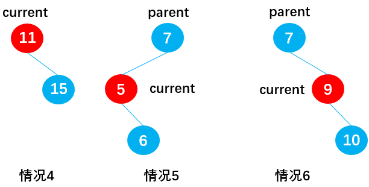

 **代码实现**

 ```js
      //情况2：删除的节点有一个子节点
      // 当current存在左子节点时：
      else if(current.right == null) {
        if(current == this.root){
          this.root = current.left;
        }else if (isLeftChild) { 
          parent.left = current.left;;
        } else {
          parent.right = current.left;
        }
      }
      //当current存在右子节点时
      else if(current.left == null) {
        if(current == this.root) {
          this.root = current.right;
        }else if(isLeftChild) {
          parent.left = current.right;
        }else {
          parent.right = current.right;
        }
      }
 ```

#### 8.3.4.3 有两个叶子节点

这种情况较为复杂，首先通过下面的二叉搜索树来讨论：

 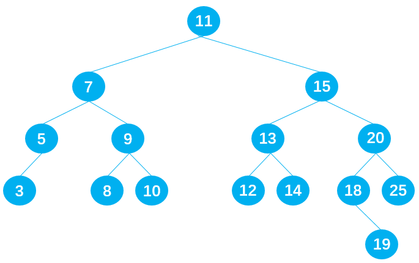

 **删除节点9**

 在保证删除节点9后原满足二叉树的前提下，有两种方式：
- 方式1：从节点9的左子树中选择一合适的节点替代节点9，可知节点8符合要求；
- 方式2：从节点9的右子树中选择一合适的节点替代节点9，可知节点10符合要求；

 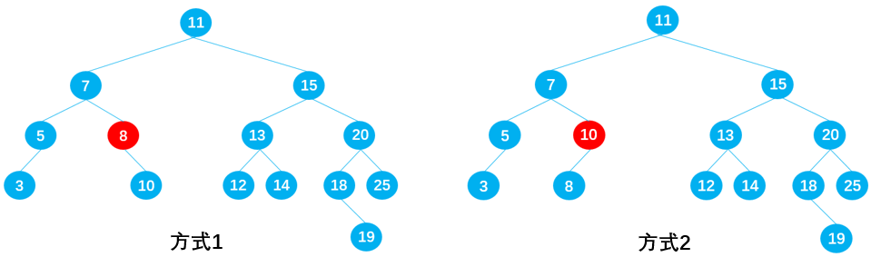

**删除节点7**

在保证删除节点7后原二叉树仍为二叉搜索树的前提下，也有两种方式：

- 方式1：从节点7的左子树中选择一合适的节点替代节点7，可知节点5符合要求；
- 方式2：从节点7的右子树中选择一合适的节点替代节点7，可知节点8符合要求；

 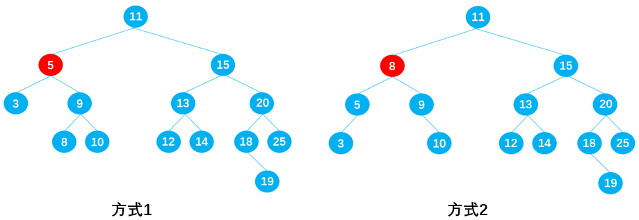

 **删除节点15**

 在保证删除节点15后原树二叉树仍为二叉搜索树的前提下，同样有两种方式：

- 方式1：从节点15的左子树中选择一合适的节点替代节点15，可知节点14符合要求；
- 方式2：从节点15的右子树中选择一合适的节点替代节点15，可知节点18符合要求；

**规律总结：**如果要删除的节点有两个子节点，甚至子节点还有子节点，这种情况下需要从要删除节点下面的子节点中找到一个合适的节点，来替换当前的节点。

若用current表示需要删除的节点，则合适的节点指的是：

- current左子树中比current小一点点的节点，即current左子树中的最大值；
- current右子树中比current大一点点的节点，即current右子树中的最小值；

**前驱&后继**

在二叉搜索树中，这两个特殊的节点有特殊的名字：

- 比current小一点点的节点，称为current节点的前驱。比如下图中的节点5就是节点7的前-驱；
- 比current大一点点的节点，称为current节点的后继。比如下图中的节点8就是节点7的后继；

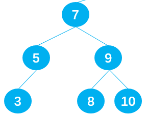

**代码实现**

- 查找需要被删除的节点current的后继时，需要在current的**右子树**中查找**最小值**，即在current的右子树中一直**向左遍历**查找。

- 查找前驱时，则需要在current的**左子树**中查找**最大值**，即在current的**左子树**中一直**向右**遍历查找。

下面以后续查找为例进行讨论。

```js
    //删除节点
    BinarySearchTree.prototype.remove = (key) => {
      //1.定义变量
      let current = this.root;  //你保存之后需要删除的节点
      let parent = null;        //保存删除节点的父节点
      let isLeftChild = true;  // 判断是否为parent的左节点

      //开始寻找删除的节点
      while(current,key != key) {
        parent = current;
        //往左边查找
        if(current.key > key) {
          isLeftChild = true;
          current = current.left;
        }else {
          isLeftChild = false;
          current = current.right;
        }

        //找到最后一个节点仍然没有找到
        if(current == null) {
          return false;
        }
      }
      // 结束循环，此时current.key == key
      
      //情况1：删除的叶子节点
      if(current.left == null && current.right == null) {
        //判断该叶子节点是否是根节点
        if(current == this.root) {
          this.root = null;
        }else if(isLeftChild) {
          parent.left = null;
        }else {
          parent.right = null;
        }
      }
      //情况2：删除的节点有一个子节点
      // 当current存在左子节点时：
      else if(current.right == null) {
        if(current == this.root){
          this.root = current.left;
        }else if (isLeftChild) { 
          parent.left = current.left;;
        } else {
          parent.right = current.left;
        }
      }
      //当current存在右子节点时
      else if(current.left == null) {
        if(current == this.root) {
          this.root = current.right;
        }else if(isLeftChild) {
          parent.left = current.right;
        }else {
          parent.right = current.right;
        }
      }

      //情况3：删除的节点有两个子节点
      else {
        //1.获取后继节点
        let successor = this.getSucceessor(current);  //这里current就是要删除的节点

        //2.判断current是否是根节点
        if(current == this.root) {
          this.root = successor;   //让root直接指向后继节点
        }
        //否则不是根节点，就要让本删除节点的父节点指后继节点
        else if (isLeftChild) {
          parent.left = successor;
        }else {
          parent.right = successor;
        }

        //3.把root指向后继节点之后，root原来的左子树也有接到后继节点上，（后继不可能有左子树）
        successor.left =current.left;

      }
    }
        //封装查找后继节点的方法
    //需要传入需要删除的节点delNode,然后根据这个节点找到它的后继
    BinarySearchTree.prototype.getSucceessor = (delNode)  => {
      //1.定义变量，保存找到的后继
      let successor = delNode;  //默认就让它等于要删除的节点
      let current = delNode.right;  //从删除节点的右子树开始查找
      let successorParent = delNode;  //记录后继节点的父节点

      //2.循环查找current的右子树节点
      while(current != null) {
        successorParent = successor;
        successor = current;
        current = current.left; //找删除节点的右子树中的最小值
      }

      //3.判断寻找的后继节点是否直接就是删除节点的right节点
      if(successor != delNode.right) {
        successorParent.left = successor.right;
        successor.right = delNode.right;   //接上右子树
      }

      return successor;
    }
```

 测试：
 ```js
   //测试代码
    //1.创建BinarySearchTree
    let bst = new BinarySearchTree()

    //2.插入数据
    bst.insert(11);
    bst.insert(7);
    bst.insert(15);
    bst.insert(5);
    bst.insert(3);
    bst.insert(9);
    bst.insert(8);
    bst.insert(10);
    bst.insert(13);
    bst.insert(12);
    bst.insert(14);
    bst.insert(20);
    bst.insert(18);
    bst.insert(25);
    bst.insert(6);
    bst.insert(19);
    
   //3.测试删除代码
    //删除没有子节点的节点
    bst.remove(3)
    bst.remove(8)
    bst.remove(10)

    //删除有一个子节点的节点
    bst.remove(5)
    bst.remove(19)

    //删除有两个子节点的节点
    bst.remove(9)
    bst.remove(7)
    bst.remove(15)

    //遍历二叉搜索树并输出
    let resultString = ""
    bst.midOrderTraversal(function(key){
      resultString += key + " "
    })
    console.log( resultString );
 ```

 可见三种情况的节点都被成功删除了。


